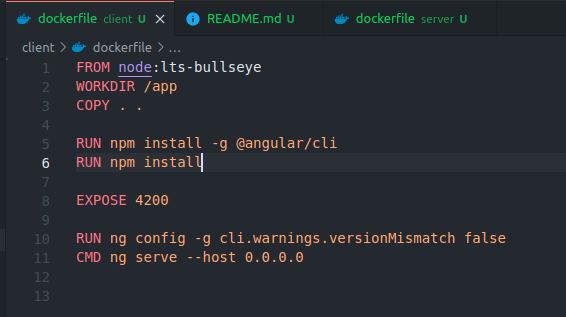
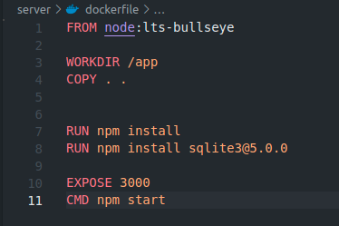
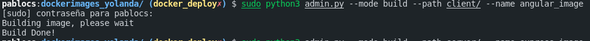
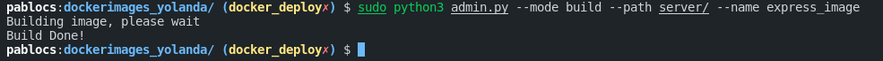
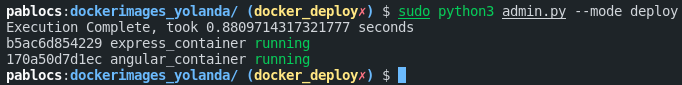
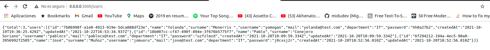
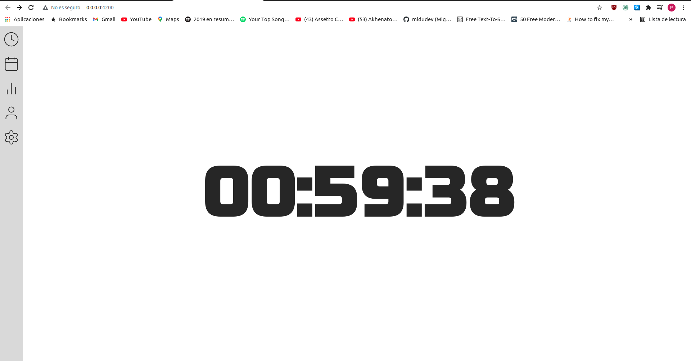
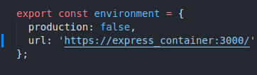
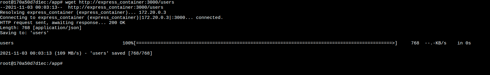
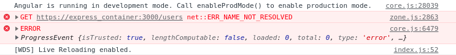

# Despliegue de Angular y Express en docker

# Preámbulo
En esta práctica, se nos pide poder desplegar en docker nuestro proyecto de la asignatura de servidor mediante la ayuda de un script para poder facilitar la tarea

# El Script
El script que controla todo el despliegue de los contenedores, así como la creación de imágenes, está realizado en python, este script nos facilita mucho el trabajo, ya que mediante la api de docker, podemos gestionar todo lo necesario.

### Ejecución del script
    sudo python3 admin.py --mode <<modo>> --path <<ruta>> --name <<nombre>>
dentro de este script, existen varios modos, desde la creación de una imagen desde un dockerfile, hasta el despliegue de todas las imágenes necesarias para poder funcionar

### Modos del script
    deploy --> despliega todo lo necesario
    list --> muestra el estado de los conenedors
    build --> construye una imagen con un determinado nombre y la ruta
    clean --> ejecuta un prune de los contenedores
    start --> arranca un contenedor
    stop --> para el contenedor
    stop:all --> para todos los contenedors

### Ejemplos de ejecución
    sudo python3 admin.py --mode deploy
    sudo python3 admin.py --mode list
    sudo python3 admin.py --mode stop:all
    sudo python3 admin.py --mode clean
    sudo python3 admin.py --mode build --path <<ruta>> --name <<nombre>>
    sudo python3 admin.py --mode stop --name <<contenedor>>
    sudo python3 admin.py --mode start --name <<contenedor>>

## Archivos DockerFile

### Análisis
Ambas imágenes parten de la imagen de node:lts-bullseye, ya que por problemas de compatibilidad no se puede usar la versión latest

### Dockerfile Angular
En este dockerfile, su uso es muy sencillo:
1. Usamos la base node:lts-bullseye
2. Establecemos el workdir /app
3. Copiamos todo el contexto a nuestro contenedor
4. Instalamos Angular CLI
5. Ejecutamos npm install para cubrir dependencias
6. Exponemos el Puerto 4200
7. Anulamos warnings con las versiones
8. Ejecutamos el comando ng serve --host 0.0.0.0

**Es muy importante la parte de --host, ya que de otro modo, no funcionará el despliegue

### Dockerfile Express
Este dockerfile es muy similar al anterior, por lo que sus pasos no distan mucho.

1. Usamos la base node:lts-bullseye
2. Establecemos el workdir /app
3. Copiamos todo el contexto a nuestro contenedor
4. Instalamos sqlite3@5.0.0
5. Ejecutamos npm install para cubrir dependencias
6. Exponemos el puerto 3000
7. Ejecutamos el comando npm start    

**Muy Importante instalar sqlite3 de forma manual, si no no funcionará el contenedor

## Build de imágenes
En este caso, el script automatiza todo el proceso del build, por lo que solo nos mostrará el comienzo y el final de la construcción de la  imagen
Imagen cliente 

Imagen servidor

## Deploy
El script también automatiza todo el proceso de deploy de los contenedores, así que con el comando:
    
    sudo python3 admin.py --mode deploy

podremos desplegar todo el proyecto dentro de la network nodeapp

## Prueba

Prueba del Servidor en express

Prueba del cliente

## Cambios realizados en el cliente

## Problemas encontrados
Hay un extraño error el cual entre contenedores podemos conectarnos, pero el módulo http de angular, no nos deja acceder a el

Prueba wget al servidor

Request desde angular
