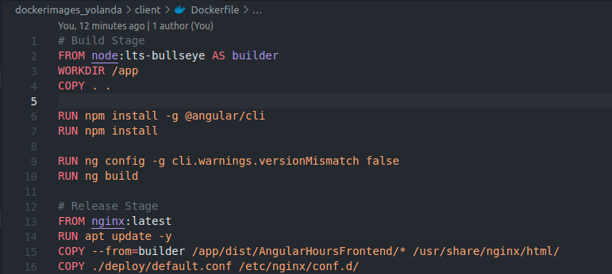
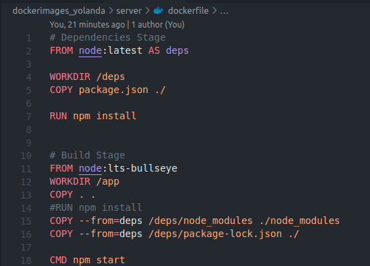
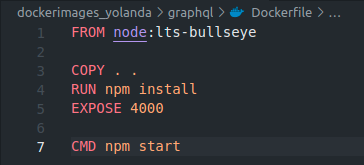
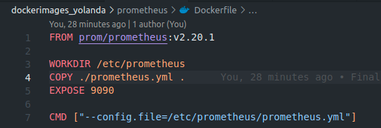
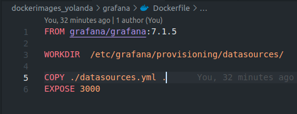
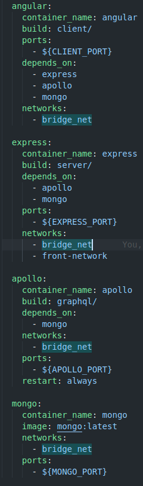
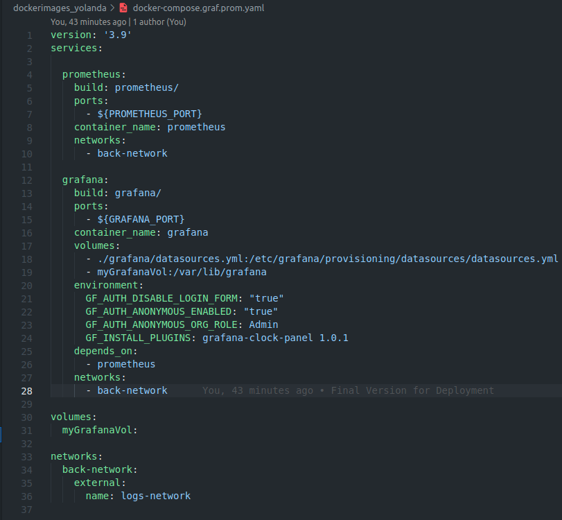
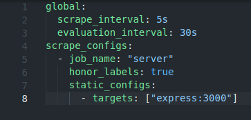
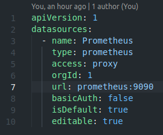
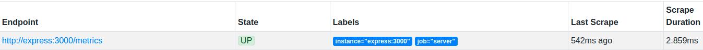

# Despliegue de Servicios con Logs en entorno con múltiples docker-compose

## Preámbulo
En esta práctica, desplegaremos el proyecto de la asignatura de programación de entorno servidor mediante docker-compose, mucho más sencillo que desplegarlo mediante Dockerimage

## Jerarquía del proyecto

    /
    |
    |-->client/ (Frontend con angular)
    |
    |-->server/ (Backend con express)
    |
    |-->graphql/ (2º backend con apollo-server)
    |
    |-->grafana/ (directorio con la imagen y configuración de grafana)
    |
    |-->prometheus/ (directorio con la imagen y configuración de prometheus)

## Análisis de imágenes
*Antes de comenzar, tanto la imagen del cliente, como la del servidor se desarrollan mediante una multistage-build
### 1.1 Imagen de Angular

En esta imagen tenemos dos stages, la primera, que se encarga de construir nuestra versión de producción del frontend, mientras que ne la segunda etapa, desplegamos con nginx la versión que ha sido construida previamente

*hay que tener dos cosas en cuenta, la primera, que al hacer un copy hay que colocar la flag --from de lo contrario no cogerá los datos de la primera etapa, y la segunda, que hay que crear una regla en nginx para que al utilizar las rutas de angular no nos devuelva un error 404.

### 1.2 Imagen de Express

En este caso, también tenemos dos etapas de construcción de la imagen, pero son diferentes a las etapas de angular, pues en este caso instalamos las dependencias en la primera fase, y luego en la segunda fase las pasamos a la imagen final

### 1.3 Imagen de Apollo Server

Esta imagen es muy sencilla de entender, pues esta no tiene una multi-stage build, usamos un workdir que es /deps, instalamos dependencias y listo, la imagen está lista para la siguiente fase del despliegue

### 1.4 Imagen de Prometheus

Para la imagen de Prometheus, nos encontramos con otra imagen sencilla, lo único que hay que cargar la configuración de prometheus para hacer que escuche en nuesto endpoint

### 1.5 Imagen de Grafana

Y por último, la imagen de grafana, la cual es mucho más sencilla que la de prometheus, pues en esta solo tendremos que copiar el archivo datasources.yml a la ruta /etc/grafana/provisioning/datasources

## Archivos docker-compose 

Ahora que todas las imágenes están preparadas, deberemos crear un docker-compose.yaml para poder desplegar el stack entero, pues sin él, de poco servirán las imágenes.

### Primer docker-compose
En este docker-compose, declararemos los servicios necesarios para poder desplegar nuestra aplicación, estos NO incluirán ni prometheus, ni grafana

En este punto declararemos todos los servicios necesarios, incluyendo una pequeña instancia de mongo, pues ésta es la base de datos que mueve apollo-server, un detalle a tener en cuenta es que los puertos están definidos como variables de entorno, esto es porque hay un archivo .env que contiene todas estas variables.

Respecto a las networks que vamos a utilizar, utilizaremos dos, una que se encargará de comunicar todo el stack entre sí, y otra que comunicará con el stack de logs

### Segundo docker-compose

En este segundo docker-compose, declararemos los servicios de grafana y prometheus, así como los volumenes necesarios, la network (la cual también comunica con el primer stack) y los parámetros del stack de autentificación y plugins requeridos en esta práctica

## Arranque de ambos stacks

El primer stack se puede arrancar con el siguiente comando:

    sudo docker-compose up -d --build

Mientras que el segundo stack se debe arrancar con el comando:

    sudo docker-compose -f "docker-compose.graf.prom.yaml" up -d --build

es muy importante especificar el archivo con el parámetro -f, de lo contrario volverá a arrancar el stack principal

*MUY IMPORTANTE: ya que nuestros stacks contienen imagenes que se deben construir, tenemos que utilizar la flag --build, de lo contrario no se nos construirán las imágenes.

## Configuración de Prometheus + Logs en Grafana
El primer punto de configuración, es el archivo prometheus.yml, situado dentro del directorio prometheus, en este especificaremos la ruta de acceso a nuestros logs

Ahora saltaremos al archivo datasources.yml dentro del directorio grafana, muy importante especificar la url de prometheus, de lo contrario no servirá para nada

Ahora que las configuraciones están hechas, habrá que ir a prometheus para comprobar que el servidor de express está funcionando y mandando los logs adecuados

Aquí podemos ver que el endpoint está funcionanod sin ningún tipo de problema, una vez tengamos esto, lo siguiente será configurar grafana para poder leer los logs que envíe prometheus.

